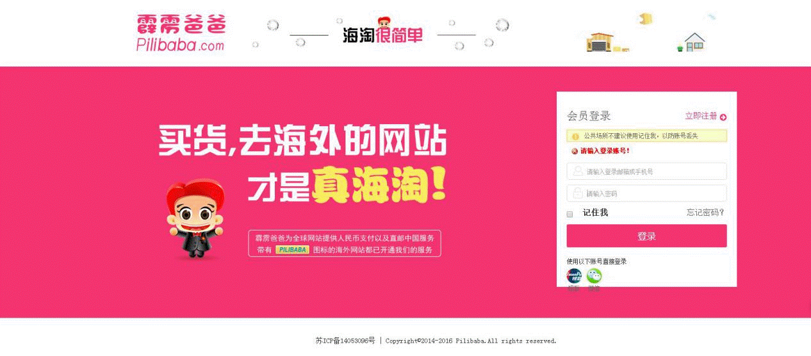

# 在Shopify中安装霹雳爸爸（Pilibaba）支付网关
([English Version](install-pilipay-in-shopify.html) | 中文版 )

## 第一步，安装『Pilibaba Payment Gateway』APP

A. 获取这个APP

点击右边的链接到Shopify的APP市场:  https://apps.shopify.com/pilibaba-payment-gateway 然后点击『GET』按钮：

B. 确认安装

C. 获取商户信息

新商户？[请点击这里注册](http://en.pilibaba.com/regist)。 [登陆霹雳爸爸（Pilibaba）]((http://en.pilibaba.com/account/login))后，你可以从成员信息页面（Member Information page）获取到 商户号(`Merchant number`) 和秘钥(`Secret key`)。

D. 将你的商户信息提交到APP中：

确认安装后，会出现一个表单。请将上一步获取到的 商户号(Merchant number) 和 秘钥(Secret key) 填写到下面的表单中，并提交。提交完成后，则这个APP就已经装好了。

 

## 第二步，在Shopify的后台中添加霹雳爸爸（Pilibaba）支付选项

 前往: shopify admin -> settings -> payment(https://***.myshopify.com/admin/settings/payments) 拷贝并将以下 红色 的内容分别粘贴到（如下图中所示的）2、3和4字段中

 `2: Pilibaba 支付（支持银联卡支付，直邮中国）`
 `3: 请点击完成付款，支持银联卡，直邮至中国大陆全境。`
 `4: 感谢您选择Pilibaba进行支付，正在为您跳转到Pilibaba的支付页面，请稍候...`

 

## 第三步，检查是否成功安装

 A. 检查已经安装的APP

 前往: shopify admin -> apps -> installed apps (https://***.myshopify.com/admin/apps) 霹雳爸爸（Pilibaba）将会出现在已经安装的APP(Installed apps)中:

 

 B. 检查支付选项

 下个订单，然后检查是否有个霹雳爸爸支付的选项：

点击『完成订单（Complete order）』按钮。如果没有登录消费者账号，则将会重定向到霹雳爸爸（Pilibaba）的登录页面：

登录后，则将会显示订单详情:

然后，作为一个消费者，就可以填写相关信息，然后选择一个常用的银行进行支付了...

## 第四步，最重要的事情：检查订单状态 ！

当霹雳爸爸（Pilibaba）收到付款后，Shopify里面的订单状态将会从『等待（Pending）』转变为『已付款（Paid）』。此时，请将货物配送至您附近的霹雳爸爸的中转仓（Warehouse）。霹雳爸爸将会负责剩下的路程——把货物从中转仓运送到消费者手上。

## 第五步，将我们的Logo放到您网站的底部：

将我们的Logo放到您的网站的底部后，中国的消费者将一眼就能看出来您的网站可以使用霹雳爸爸支付。这有助于提升用户体验，吸引更多的中国的消费者。 点击下图下载Logo:

## 联系我们

如果您有任何疑问，请邮件联系我们：[developer@pilibaba.com](mailto:developer@pilibaba.com). 此外，还可以通过Skype来联系我们: developer@pilibaba.com.
